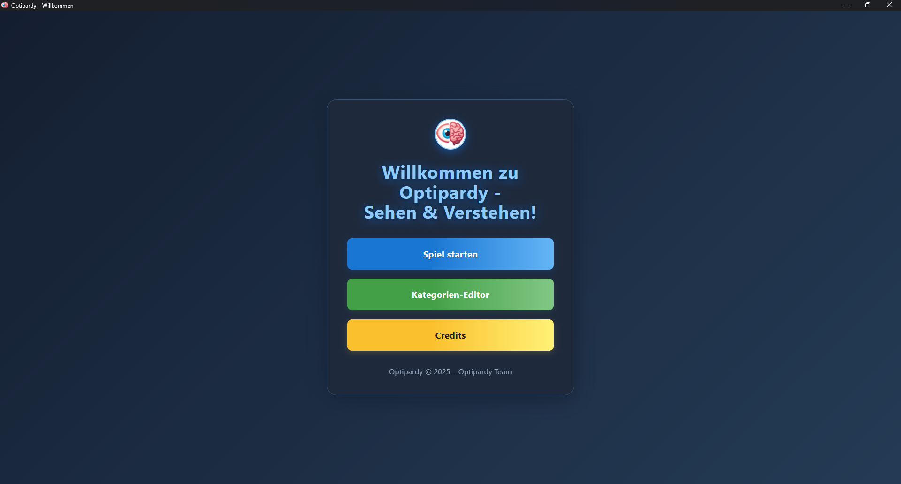
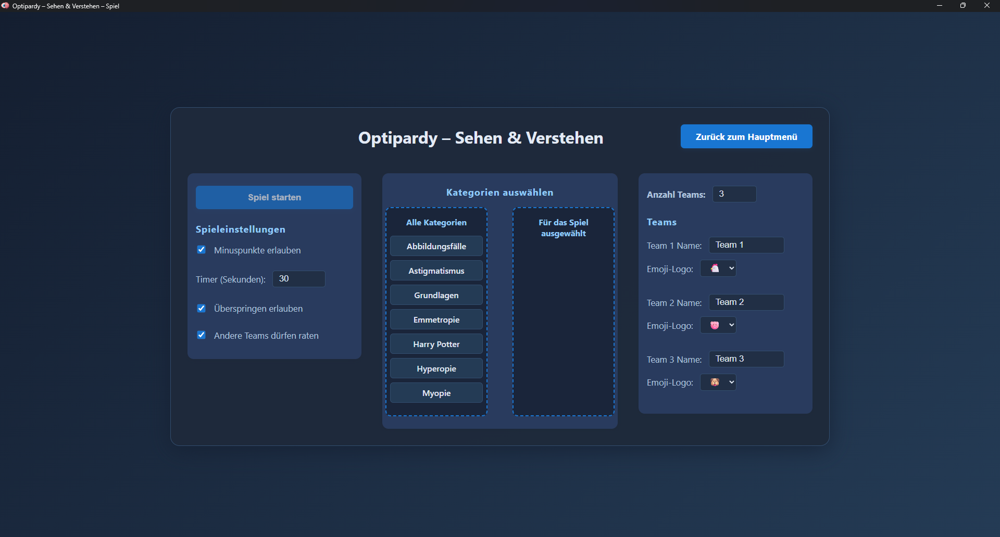
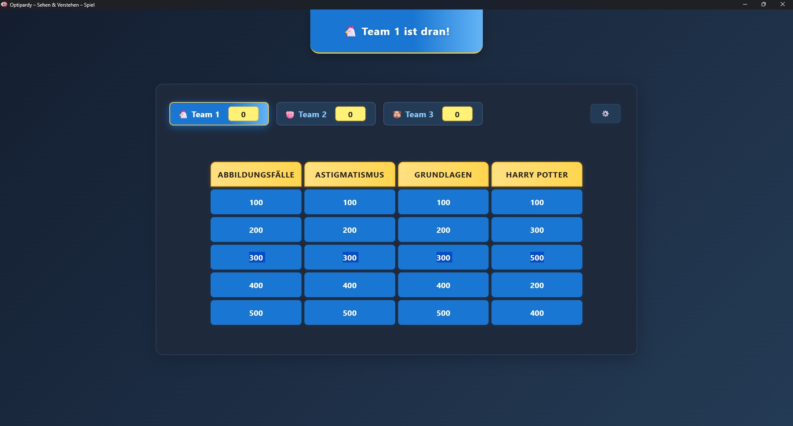
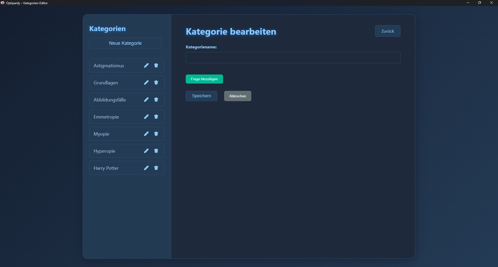
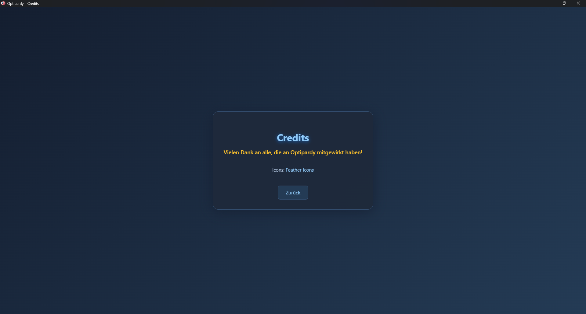

<p align="center">  </p> <h1 align="center">Optipardy</h1> <p align="center"> <b>Das lokale Jeopardy-Quiz für Freunde, Familie und Kollegen.<br> Schnell, modern, plattformübergreifend.</b> </p> <p align="center"> <a href="https://github.com/Gaaraszauber/Optipardy/releases"></a> <a href="https://github.com/Gaaraszauber/Optipardy/blob/main/LICENSE"></a> <a href="https://github.com/Gaaraszauber/Optipardy/issues"></a> </p>
✨ Features
Klassisches Jeopardy-Feeling als lokale Electron-App

Multiplayer: Gemeinsam am PC oder im Netzwerk spielen

Einfacher Start – keine Installation nötig, alles lokal

Plattformübergreifend: Windows, macOS, Linux

Individuelle Fragen & Kategorien möglich

Modernes, intuitives Design

🚀 Schnellstart
Voraussetzungen:

Node.js installiert

Projekt klonen:
```
git clone https://github.com/Gaaraszauber/Optipardy.git
cd Optipardy
```
Abhängigkeiten installieren:
```
npm install
```
Server starten:
```
npm run server
```
Electron-App starten:
```
npm start
```
🖼️ Screenshots
<p align="center">     </p>
<p align="center">     </p>

🛠️ Build & Deployment

Windows-Build:
```
npm run pack-win
```
Linux-Build:
```
npm run pack-linux
```
macOS-Build:
```
npm run pack-mac
```
Die fertigen Dateien findest du im dist-Ordner.

📦 Abhängigkeiten
Paket	Zweck
electron	Desktop-App
express	Lokaler Server
chalk	Konsolenausgabe
open	Öffnet Browser
p-try	Promise-Handling
👩‍💻 Entwicklung
Befehl	Beschreibung
npm run server	Startet den lokalen Server
npm start	Startet die Electron-App
npm run pack-win	Erstellt Windows-Executable
npm run pack-mac	Erstellt macOS-Executable
🤝 Mitmachen
Pull Requests, Ideen und Feedback sind herzlich willkommen!
Schau dir die Issues an oder eröffne selbst eine.

📄 Lizenz
Dieses Projekt steht unter der ISC-Lizenz.

<p align="center"> <b>Viel Spaß beim Spielen mit Optipardy! 🎉</b> </p>
